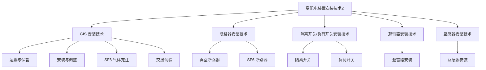

## 本节框架

---

## 1. 六氟化硫封闭式组合电器（GIS）安装技术

> **GIS** = Gas Insulated Substation（气体绝缘全封闭组合电器）。将除变压器以外的断路器、隔离开关、母线、互感器、避雷器、套管等带电部分全密封集成，用 SF6 灭弧，实现电力控制、保护、分配、隔离作用。

### 1.1 运输与保管

| 项目 | 要求 |
|------|------|
| 运输姿态 | 不得倒置、倾翻、碰撞和受到剧烈振动 |
| 压力检查 | 充有干燥气体的单元或部件，其压力值应符合技术文件要求 |
| 防潮保管 | 有防潮要求的附件、备件、专用工器具及设备专用材料应置于**干燥的室内**，特别是组装用"O"形圈、吸附剂等 |

### 1.2 安装与调整

- 基础：GIS 组合电器基础混凝土强度应达到设备安装要求，预埋件接地应良好
- 环境：装配工作应在**无风沙、无雨雪、空气相对湿度小于 80%** 的条件下进行，并应采取**防尘、防潮**措施
- **套管要求**：
  - 瓷外套：瓷套与金属法兰胶装部位应牢固密实并涂有性能良好的防水胶
  - 硅橡胶外套：外观不得有裂纹、损伤、变形
- **密度继电器**：与设备本体 SF6 气体管道的连接，应满足可与设备本体管路系统**隔离**，以便对密度继电器进行**校验**
- **封盖前检查**：每次内检、安装和试验工作结束后，应清点用具、用品，检查确认无遗留物后方可封盖

### 1.3 六氟化硫气体充注

- 新 SF6 气体应有**出厂检验报告及合格证明文件**，运到现场后每瓶均应做**含水量检验**
- SF6 气瓶的安全帽、防震圈应齐全，搬运时严禁抛掷溜放
- 气体充入前应按技术文件要求对设备内部进行**真空处理**

### 1.4 GIS 交接试验

| 序号 | 试验项目 | 关键要求 |
|------|----------|----------|
| 1 | 操动试验 | 联锁与闭锁装置动作应准确可靠；电动、气动或液压装置的操动试验应按产品技术条件规定进行 |
| 2 | 导电主回路电阻测量 | 宜采用电流**不小于 100A 的直流压降法**；测试结果不应超过产品技术条件规定值的**1.2 倍** |
| 3 | 密封试验 | 充气 **24h 以后**，且组合操动试验后进行；检漏仪灵敏度不低于 **1×10⁻⁶**（体积比）；可采用**局部包扎法**；每个气室年漏气率不应大于 **1%**（750kV 不应大于 **0.5%**） |
| 4 | SF6 气体含水量测量 | 充气 **24h 后**进行；有电弧分解隔室 < **150μL/L**；无电弧分解隔室 < **250μL/L** |
| 5 | 交流耐压试验 | 试验电压值为出厂试验电压值的 **80%**；主回路在 **1.2Ue/√3** 电压下应进行**局部放电检测** |
| 6 | 气体密度继电器及压力动作阀检查 | 在充气过程中检查动作值；单独运到现场的表计应进行核对性检查 |

> **补充**：最高电压 = 1.2 额定电压。标注线电压（导体间），转化为相电压（相对地，导体与外壳），相电压 = 线电压/√3。

---

## 2. 断路器安装技术（真空、六氟化硫）

### 2.1 运输与保管（通用）

- 运输过程中不得倒置、强烈振动和碰撞
- 灭弧室的运输应按**易碎品**的规定进行
- 灭弧室、瓷套与铁件间应粘合牢固、无裂纹及破损
- 定期检查灭弧室内压力，并做好记录

### 2.2 真空断路器安装

| 项目 | 要求 |
|------|------|
| 安装姿态 | 应**垂直**，固定应牢固 |
| 相间支持瓷套 | 应在同一水平面上 |
| 三相联动连杆拐臂 | 应在同一水平面上，拐臂角度应一致 |
| 分合闸操作顺序 | 具备慢分、慢合功能时，先进行**手动缓慢**分、合闸操作，正常后方可进行**电动**分、合闸操作 |

### 2.3 六氟化硫断路器安装

| 项目 | 要求 |
|------|------|
| 均压电容、合闸电阻 | 应经现场试验，应符合技术文件要求 |
| 操动机构 | 零件齐全，轴承应光滑、无卡涩，铸件应无裂纹或焊接不良 |
| 罐式断路器 | 安装前应核对电流互感器二次绕组排列次序及变比、极性、级次等 |
| 灭弧室组装 | 空气相对湿度应小于 **80%**，并应采取防尘、防潮措施 |
| 支架垫片 | 不宜超过 **3 片**，总厚度不应大于 **10mm** |

### 2.4 真空断路器交接试验

真空断路器交接试验项目主要包括：
1. 测量绝缘电阻
2. 测量每相导电回路的电阻
3. 交流耐压试验
4. 测量断路器的分、合闸时间
5. 测量分、合闸的同期性
6. 测量合闸时触头的弹跳时间
7. 测量分、合闸线圈及合闸接触器线圈的绝缘电阻和直流电阻
8. 断路器操动机构的试验等

### 2.5 SF6 断路器交接试验

| 序号 | 试验项目 | 关键要求 |
|------|----------|----------|
| 1 | 整体绝缘电阻值 | 符合产品技术文件规定 |
| 2 | 每相导电回路电阻 | 宜采用电流**不小于 100A 的直流压降法**，结果符合产品技术条件规定 |
| 3 | 交流耐压试验 | SF6 气压为额定值时进行，试验电压为出厂值的**80%**；**110kV 以下**：合闸对地 + 断口间耐压；**罐式断路器**：合闸对地 + 断口间耐压，1.2Ue/√3 下局部放电检测；**500kV 定开距瓷柱式**：合闸对地 + 断口耐压 |
| 4 | 分合闸线圈绝缘电阻 | 不应低于 **10MΩ**（断食） |
| 5 | SF6 气体含水量 | 充气 **24h 后**测量：与灭弧室相通气室 < **150μL/L**；不与灭弧室相通气室 < **250μL/L** |
| 6 | 密封试验 | 检漏仪灵敏度不低于 **1×10⁻⁶**；可用**局部包扎法**；年漏气率不应大于 **0.5%**；充气 **24h 后**且开关操动试验后进行 |

---

## 3. 隔离开关、负荷开关安装技术

### 3.1 运输与保管

- 设备运输箱应按其不同保管要求置于**平整、无积水且坚硬**的场地
- 装有触头及操动机构金属传动部件的箱子应有**防潮措施**
- 瓷件应**无裂纹、破损**；瓷瓶与金属法兰胶装部位应**牢固密实**，并涂有性能良好的**防水胶**

### 3.2 安装与调整

| 序号 | 项目 | 要求 |
|------|------|------|
| 1 | 支架定位 | 支架柱轴线行、列定位轴线允许偏差 **5mm**，同相根开允许偏差 **10mm** |
| 2 | 相间连杆 | 应在同一水平线上 |
| 3 | 支柱绝缘子 | 可用金属垫片校正水平或垂直偏差，使触头相互对准、接触良好 |
| 4 | 操动机构 | 零部件齐全，固定连接紧固，转动部分涂以适合当地条件的**润滑脂** |
| 5 | 操作顺序 | 电动操作前，先进行多次**手动**分、合闸，机构动作正确后方可电动 |
| 6 | 限位装置 | 应准确可靠，到达规定分、合极限位置时应可靠**切除电源** |
| 7 | 机构箱 | 密闭良好、防雨防潮；加热器与各元件、电缆及电线的距离应大于 **50mm** |
| 8 | 引弧触头顺序 | 从分到合：引弧触头**先接触**后主动触头接触；从合到分：断开顺序相反 |
| 9 | 触头接触 | 接触紧密，表面平整清洁，涂以薄层**中性凡士林**（润滑、防锈） |
| 10 | 连接端子 | 涂以薄层**电力复合脂**（导电、增大接触面积），螺栓齐全紧固 |
| 11 | 接地刀闭锁 | 接地刀与主触头间的机械或电气闭锁应准确可靠 |
| 12 | 负荷开关动作 | 合闸时：主固定触头与主刀可靠接触；分闸时：三相灭弧刀片同时跳离固定灭弧触头 |

### 3.3 隔离开关、负荷开关交接试验

1. **测量绝缘电阻**：有机材料传动杆的绝缘电阻值
2. **测量负荷开关导电回路电阻值**：宜采用电流不小于 **100A** 的直流压降法
3. **交流耐压试验**：
   - 三相同一箱体的负荷开关：按相间及相对地进行耐压试验，还应进行每个断口的交流耐压试验
   - 试验电压应符合真空断路器的试验电压规定
4. **35kV 及以下**电压等级隔离开关的交流耐压试验，可在母线安装完毕后一起进行

---

## 4. 避雷器安装技术

### 4.1 运输与保管

- 正置立放，不得倒置和受到冲击与碰撞
- 复合外套避雷器不得与酸碱等腐蚀性物品放在同一车厢内运输
- 不得随意拆开，破坏密封

### 4.2 避雷器安装

| 序号 | 项目 | 要求 |
|------|------|------|
| 1 | 带自闭阀的避雷器 | 宜进行**压力检查**，压力值应符合技术文件要求 |
| 2 | 绝缘底座安装 | 应**水平** |
| 3 | 金属接触表面 | 洁净、无氧化膜和油漆、导通良好 |
| 4 | 并列安装 | 三相中心应在同一直线上；相间中心距离允许偏差 **10mm**；铭牌位于易于观察的一侧 |
| 5 | 排气通道 | 通畅，排气口**不得朝向巡检通道**，排出的气体不致引起相间或对地闪络，并不得喷及其他电气设备 |
| 6 | 监测仪 | 安装位置一致、便于观察，接地应可靠，计数器应调至同一值 |

### 4.3 避雷器交接试验

**（1）绝缘电阻测量**

| 电压等级 | 兆欧表规格 | 绝缘电阻值要求 |
|-----------|------------|----------------|
| 1kV 以下 | 500V | 不应小于 **2MΩ** |
| 35kV 及以下 | 2500V | 不应小于 **1000MΩ** |
| 35kV 以上 | 5000V | 不应小于 **2500MΩ** |

**（2）工频参考电压和持续电流**（日常承压测试）：符合现行国家标准或产品技术规定

**（3）直流参考电压和泄漏电流**（极限承压测试 + 临界值测试）：
- 测量金属氧化物避雷器直流参考电压
- 测量 **0.75 倍**直流参考电压下的泄漏电流

**（4）工频放电电压试验**：
- 放电后应快速切除电源，切断电源时间不应大于 **0.5s**
- 过流保护动作电流应控制在 **0.2~0.7A** 之间

---

## 5. 互感器安装技术

### 5.1 运输与保管

- 防止受潮、倾倒或遭受机械损伤
- 整体起吊时，吊索应固定在规定的吊环上，不得损伤伞裙

### 5.2 互感器安装

| 序号 | 项目 | 要求 |
|------|------|------|
| 1 | 支架 | 封顶板安装面应**水平**；并列安装应排列整齐，同一组互感器的极性方向应一致 |
| 2 | 电容式电压互感器 | 根据产品成套供应的**组件编号**安装，**不得互换**；组件连接处接触面应除去氧化层，涂以**电力复合脂** |
| 3 | 均压环 | 安装在环境 **0℃及以下**地区的均压环应在**最低处打放水孔**（防积水冻裂） |
| 4 | 零序电流互感器 | 不应使构架或其他导磁体与互感器铁芯直接接触或构成磁回路分支（防磁短路） |
| 5 | 外壳接地 | 应**可靠接地** |
| 6 | 电流互感器备用二次绕组端子 | 应**先短路后接地** |

### 5.3 互感器交接试验

**（1）绝缘电阻测量**
- 测量一次绕组对二次绕组及外壳、各二次绕组间及其对外壳的绝缘电阻
- 绝缘电阻值不宜低于 **1000MΩ**
- 应使用 **2500V** 兆欧表

**（2）介质损耗因数（tanδ）测量**
- 电压等级 **35kV 及以上**的油浸式互感器应测量
- tanδ 越小越好（绝缘好、损耗小、不发热）；tanδ 大表示老化受潮脏污

**（3）局部放电测量**
- 宜与交流耐压试验同时进行
- **35~110kV** 互感器可按 **10%** 抽测
- **220kV 及以上**互感器在绝缘性能有怀疑时宜进行局部放电测量

**（4）交流耐压试验**
- 按出厂试验电压的 **80%** 进行，并应在高压侧施加试验电压
- **66kV 及以上**油浸式互感器：交流耐压前后宜进行一次**绝缘油色谱分析**
- 电磁式电压互感器应进行**感应耐压试验**

**（5）绕组直流电阻测量**

| 类型 | 绕组 | 偏差要求 |
|------|------|----------|
| 电压互感器 | 一次绕组 | 与出厂值比较，相差不宜大于 **10%** |
| 电压互感器 | 二次绕组 | 与出厂值比较，相差不宜大于 **15%** |
| 电流互感器 | 同型号同批次 | 直流电阻与平均值的差异不宜大于 **10%** |

---

## 通用要点归纳

### 通用规律：进场→安装→试验三步法

| 阶段 | 通用要求 |
|------|----------|
| **进场前** | 齐全、无锈蚀/无裂纹/无损伤/无破损/无变形（5 无）；文件齐全（合格证、检验报告） |
| **安装时** | 连接牢固、接触良好、同一水平 |
| **安装后** | 联动正常、无卡阻、分合闸指示正确、开关动作正确、传动正确 |
| **交接试验** | 电阻测量、耐压试验、分合闸试验、报警值校验、闭锁值校验 |
| **密封接地** | 密封良好、牢固、接地可靠、连接可靠 |
| **气体检查** | 压力值和含水量符合要求 |

### 各设备交接试验横向对比

| 设备 | 回路电阻测量 | 耐压试验 | 气体含水量 | 密封/漏气率 | 特殊项 |
|------|-------------|---------|-----------|------------|--------|
| GIS | >=100A 直流压降法，<=1.2 倍规定值 | 80% 出厂值；1.2Ue/√3 局放检测 | 电弧隔室 <150μL/L；无电弧 <250μL/L | 年漏气率 <=1%（750kV <=0.5%） | 密度继电器校验 |
| SF6 断路器 | >=100A 直流压降法 | 80% 出厂值；110kV 以下合闸对地+断口 | 与灭弧室相通 <150μL/L；不通 <250μL/L | 年漏气率 <=0.5% | 分合闸线圈绝缘 >=10MΩ |
| 真空断路器 | >=100A 直流压降法 | 交流耐压 | - | - | 触头弹跳时间 |
| 隔离开关/负荷开关 | >=100A 直流压降法（仅负荷开关） | 相间+相对地+断口耐压 | - | - | - |

---

## 例题

**【例题·单选】密度继电器与设备本体六氟化硫气体管道连接的作用是（  ）。【2025】**

A. 便于校验  
B. 保证密封  
C. 防止泄露  
D. 提高精度  

> **【答案】A**  
> **【解析】** 密度继电器与设备本体六氟化硫气体管道的连接，应满足可与设备本体管路系统隔离，以便对密度继电器进行校验。
