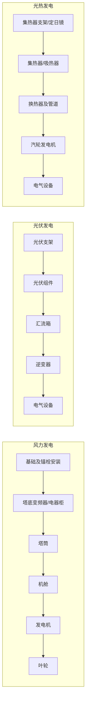

# 第61讲：4.8 风力发电及太阳能发电设备安装技术

## 考点考情

| 考点 | 星级 | 近年真题 |
|------|------|----------|
| 风力发电设备安装技术 | ★ | — |
| 太阳能发电设备安装技术 | ★ | 2018多选、2021单选、2021二批单选 |

---

## 考点1：风力发电设备安装技术

### 1.1 安装程序

**核心原则：自下而上**

```
施工准备 → 基础及锚栓安装 → 塔底变频器、电器柜安装 → 塔筒安装 → 机舱安装 → 发电机安装
→ 叶片与轮毂地面组合 → 叶轮安装 → 其他零部件安装 → 电气设备安装 → 调试试运行 → 验收
```

> **口诀提醒**：自下而上逐级安装，风机基础环与第一段塔筒连接螺栓须刷润滑油。

### 1.2 安装技术要求

#### 1）施工前准备
- 编制**专项施工方案**
- 根据现场条件和设备特点，选择恰当的吊装机械、专用工具和辅助材料

#### 2）预应力锚栓、基础平台、变频器、塔基柜安装要求

| 工序 | 技术要求 |
|------|----------|
| 基础锚栓及上锚板 | 检查清理，检查水平度，确保偏差在厂家规定范围内；清理基础表面及锚板杂物 |
| 基础预埋安装支脚 | 检查无误后安装塔底平台，依次吊装变流器、塔底控制柜、水冷柜就位 |

#### 3）塔筒安装要求

- 塔筒分多段供货，根据**塔筒重量、尺寸以及安装高度**选择吊车吊装工况
- 安装顺序：**由下至上**
- **第一节安装前**：在第一节塔筒下法兰外缘和内缘各涂一圈**密封胶**，结合面法兰清理干净
- 螺栓紧固：分别使用**电动扳手和液压扳手**等专用工具，按厂家要求紧固

#### 4）机舱安装要求

| 项目 | 要求 |
|------|------|
| 主轴法兰/紧固件 | 检查、清洗，螺栓表面涂抹润滑脂 |
| 液压站/锁紧定位销 | 检查到位 |
| 风速仪、航空灯等附件 | 按厂家要求安装 |
| 连接螺栓紧固 | 使用电动扳手和液压扳手等设备进行紧固 |

#### 5）叶轮安装要求

- **地面组合**：检查轮毂、叶片表面有无损伤，确认无异常后将轮毂固定在组合支架上与**3片叶片**进行组合
- **吊装要求**：保持叶片位置和角度的正确，对叶片与吊索具及溜绳进行防护
- **螺栓紧固**：使用电动扳手和液压扳手等设备进行紧固

---

## 考点2：太阳能发电设备安装技术

### 2.1 光伏发电设备安装技术

#### 1）安装程序

```
施工准备 → 基础检查验收 → 设备检查 → 光伏支架安装 → 光伏组件安装
→ 汇流箱安装 → 逆变器安装 → 电气设备安装 → 调试 → 验收
```

#### 2）安装技术要求

**施工前准备**
- 制定**专项施工方案**
- 方案中应包含在运输和安装中防止光伏组件**损伤的针对性措施**

**（1）支架安装要求**

| 类型 | 要求 |
|------|------|
| 固定/手动可调支架（型钢结构） | 安装和紧固的紧固度符合设计要求；紧固点牢固，不应有弹垫未压平现象 |
| 支架倾斜度 | 角度符合设计要求 |
| 手动可调支架 | 调整动作灵活，高度角调整范围满足设计要求 |
| 跟踪式支架 | 与基础固定牢固，跟踪电机运转平稳 |

**（2）光伏组件安装要求**

- 检查光伏组件及各部件设备应完好
- 光伏组件采用**螺栓**进行固定，力矩符合产品或设计要求
- 组件串接线后应进行**开路电压和短路电流**测试
- 施工时**严禁接触组串的金属带电部位**

> ⚠️ **安全红线**：光伏组件串测试时严禁接触金属带电部位。

**（3）汇流箱安装要求**
- 安装位置符合设计要求
- 垂直度偏差应 **< 1.5mm**

**（4）逆变器安装要求**
- 基础型钢顶部应高出抹平地面 **10mm**
- 应有可靠的**接地**

**（5）设备及系统调试**

调试内容主要包括：

| 调试项目 | 说明 |
|----------|------|
| 光伏组件串测试 | 开路电压和短路电流测试 |
| 跟踪系统调试 | 跟踪式支架电机运转平稳性 |
| 逆变器调试 | 功能验证 |
| 通信调试 | 数据通信正常 |
| 升压变电系统调试 | 升压变电设备功能验证 |

### 2.2 光热发电设备安装技术

> 光热发电分为：**槽式光热发电**、**塔式光热发电**两种。

#### 1）安装程序对比

| 类型 | 安装程序 |
|------|----------|
| **槽式光热** | 施工准备 → 基础检查验收 → 设备检查 → 集热器支架安装 → 集热器及附件安装 → 换热器及管道系统安装 → 汽轮发电机设备安装 → 电气设备安装 → 调试 → 验收 |
| **塔式光热** | 施工准备 → 基础检查验收 → 设备检查 → 定日镜安装 → 吸热器钢结构安装 → 吸热器及系统管道安装 → 换热器及系统管道安装 → 汽轮发电机设备安装 → 电气设备安装 → 调试 → 验收 |

> **关键区别**：槽式始于"集热器支架安装"（含集热器），塔式始于"定日镜安装"（含吸热器钢结构/吸热器）。

#### 2）安装技术要求（通用）

- 安装前制定**专项施工方案**
- 集热器按槽式设备和塔式设备各自制定**针对性**的安装要求

#### 3）槽式光热发电集热器安装技术要求

| 序号 | 技术要求 |
|------|----------|
| ① | 紧固件先进行**初紧**，全部安装完成后**终紧**，记录初拧/终拧扭矩 |
| ② | 集热器从**驱动端到末端**安装；轴系销钉/销轴满足技术要求，紧固螺栓满足力矩设计要求 |
| ③ | 每个单元集热器安装后应进行**旋转试验**，转动角度在 **-180° 到 +180°** 之间，误差 **±10°** |
| ④ | 集热器安装**0°位置验证**：驱动装置将开口调整到0°位置，使用测斜仪测量，倾斜高差值 **≤3mm** |
| ⑤ | 集热器单元旋转：应达到设计旋转极限点 **±120°**，误差值 **≤10°**，且符合设计误差要求 |

#### 4）塔式光热发电集热设备安装技术要求

- **定日镜**：与支架固定牢固，安装位置、镜面调整角度符合设计要求
- **塔式吸热器**：
  - 管屏设备内部应清洁，无杂物、无堵塞
  - 安装时应对称进行
  - 单面安装应**不多于2组**

---

## 典型真题

### 例题1（2021单选）

**题目**：下列安装工序中，不属于光伏发电设备安装程序的是（ ）。

A. 汇流箱安装
B. 逆变器安装
C. 集热器安装
D. 电气设备安装

**答案**：**C**

**解析**：光伏发电设备安装程序为：施工准备 → 基础检查验收 → 设备检查 → 光伏支架安装 → 光伏组件安装 → 汇流箱安装 → 逆变器安装 → 电气设备安装 → 调试 → 验收。"集热器安装"属于槽式光热发电设备安装程序。

---

### 例题2（2021二级第一批）

**题目**：下列设备中，不属于光热发电系统的是（ ）。

A. 汇流箱
B. 定日镜
C. 集热器
D. 热交换器

**答案**：**A**

**解析**：光热发电设备包括集热器设备、热交换器、汽轮发电机等设备。其中：
- **槽式光热**：集热器由集热器支架（驱动塔架、支架）、集热器（驱动轴、悬臂、反射镜、集热管、集热管支架、管道支架等）及集热器附件等组成
- **塔式光热**：集热设备由定日镜、吸热器钢架和吸热器设备等组成
- **汇流箱**属于光伏发电系统，不属于光热发电系统

---

## 本章总结

### 三大发电系统安装程序对比



### 易混点辨析

| 对比项 | 风力发电 | 光伏发电 | 光热发电 |
|--------|----------|----------|----------|
| 开工前文件 | 专项施工方案 | 专项施工方案 | 专项施工方案 |
| 安装起点 | 基础及锚栓 | 光伏支架 | 集热器支架/定日镜 |
| 核心设备 | 塔筒、机舱、叶轮 | 光伏组件、逆变器 | 集热器/吸热器、换热器 |
| 特有检测 | — | 开路电压+短路电流测试 | 旋转试验（-180°~+180°，±10°） |
| 分类 | — | — | 槽式、塔式两种 |

### 数字速记

| 项目 | 参数 |
|------|------|
| 汇流箱垂直度偏差 | < 1.5mm |
| 逆变器基础型钢高出地面 | 10mm |
| 集热器旋转试验角度 | -180° ~ +180°，误差±10° |
| 集热器0°位置倾斜高差 | ≤3mm |
| 集热器单元旋转极限点 | ±120°，误差≤10° |
| 塔式吸热器单面安装 | ≤2组 |
